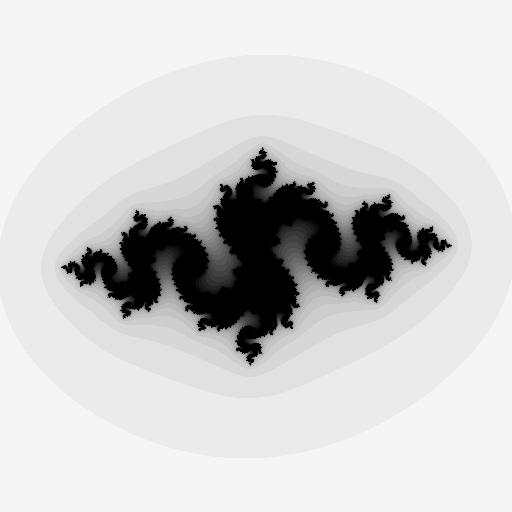

# julia-by-aws-lambda

🐩🐩🐩 AWS Lambdaでジュリア集合を描画するサンプルです。  

  

## イロイロ情報

### AWS SAM CLI のインストール

[公式ページ](https://docs.aws.amazon.com/ja_jp/serverless-application-model/latest/developerguide/install-sam-cli.html)の説明に沿って、インストールします。  
AWS SAM CLIとは、Serverless Application Model の略称でAWS Lambdaのローカル実行環境を提供するツールです。  

---

前提として、`AWS CLI`がインストールされている必要があります。  
`AWS CLI`のインストール方法は、[公式ページ](https://docs.aws.amazon.com/ja_jp/cli/latest/userguide/install-cliv2.html)を参照してください。  

### ラムダプロジェクトの作成

以下のコマンドで、プロジェクトを作成します。  

```shell
sam init
```

対話形式で、プロジェクトの設定を行います。  

```shell
You can preselect a particular runtime or package type when using the `sam init` experience.
Call `sam init --help` to learn more.

Which template source would you like to use?
        1 - AWS Quick Start Templates
        2 - Custom Template Location
Choice: 1

Choose an AWS Quick Start application template
        1 - Hello World Example
        2 - Multi-step workflow
        3 - Serverless API
        4 - Scheduled task
        5 - Standalone function
        6 - Data processing
        7 - Infrastructure event management
        8 - Serverless Connector Hello World Example
        9 - Multi-step workflow with Connectors
        10 - Lambda EFS example
        11 - Machine Learning
Template: 1

Use the most popular runtime and package type? (Python and zip) [y/N]: y

Would you like to enable X-Ray tracing on the function(s) in your application?  [y/N]: N

Would you like to enable monitoring using CloudWatch Application Insights?
For more info, please view https://docs.aws.amazon.com/AmazonCloudWatch/latest/monitoring/cloudwatch-application-insights.html [y/N]: N

Project name [sam-app]: julia-by-aws-lambda

Cloning from https://github.com/aws/aws-sam-cli-app-templates (process may take a moment)

    -----------------------
    Generating application:
    -----------------------
    Name: julia-by-aws-lambda
    Runtime: python3.9
    Architectures: x86_64
    Dependency Manager: pip
    Application Template: hello-world
    Output Directory: .

    Next steps can be found in the README file at ./julia-by-aws-lambda/README.md


Commands you can use next
=========================
[*] Create pipeline: cd julia-by-aws-lambda && sam pipeline init --bootstrap
[*] Validate SAM template: cd julia-by-aws-lambda && sam validate
[*] Test Function in the Cloud: cd julia-by-aws-lambda && sam sync --stack-name {stack-name} --watch
```

### ローカルでの実行

以下のコマンドで、ローカルで実行できます。  

```shell
sam build --use-container
sam local start-api
```

リクエストの送信をコマンドで同時に行う場合は、以下のコマンドを実行します。  

```shell
sam local invoke
```

### デプロイ

以下のコマンドで、デプロイできます。  

```shell
sam build --use-container
sam deploy [--guided]
```

初回デプロイ後はリソースベースのポリシーでパブリックアクセスを許可する必要があります。  
これは、セキュリティ上の理由から、デフォルトでは許可されておらず、AWSコンソールから許可することもできません。  
※[公式サイト](https://docs.aws.amazon.com/ja_jp/lambda/latest/dg/urls-auth.html)より。  
この状態で、デプロイしたAPIのURLにアクセスすると、`403 Forbidden`が返ってきます。  

関数を選択し、「設定 - 関数URL」へ進み、編集タブをクリックし、JSONコードの`principal`を`*`に変更します。  
これで保存するとアクセスできます。  

## 自分用メモ

### ラムダで文字列以外を返す

戻り値の辞書データの`isBase64Encoded`を`True`にし、`Body`にbase64エンコードしたバイナリデータを入れる。  
そのまま返そうとすると、文字列として解析されてエラーが発生する。  

### 関数の引数に注意

APIゲートウェイを使用した場合と、関数URLを直接叩いた場合で、引数のデータ型が異なる点に注意する。  
